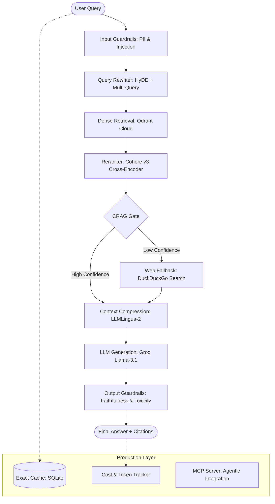

# 🚀 Advanced Production RAG — ArXiv Research Explorer

[](https://www.python.org/)
[](https://fastapi.tiangolo.com/)
[](https://qdrant.tech/)
[](https://groq.com/)
[](https://opensource.org/licenses/Apache-2.0)

A high-performance, **advanced RAG (Retrieval-Augmented Generation)** system designed for production scale. This project goes beyond basic "vector search + LLM" by implementing state-of-the-art techniques like **Corrective RAG (CRAG)**, **Query Rewriting (HyDE)**, and **Multi-Stage Reranking**, all while maintaining a **zero-local-GPU footprint**.

---

## 🏗️ System Architecture



---

## 🌟 Advanced RAG Features

### 1. Intelligence & Retrieval
- **Query Rewriting (HyDE)**: Generates a hypothetical research abstract to align the vector space, dramatically improving similarity matching.
- **Multi-Query Expansion**: Generates multiple rephrasings of the query to capture diverse semantic angles from the 15k+ document corpus.
- **Corrective RAG (CRAG)**: An LLM-based "Gate" that evaluates retrieval quality. If retrieval is irrelevant, it triggers an automated **Web Fallback** via DuckDuckGo to prevent hallucinations.
- **Multi-Stage Reranking**: Uses Cohere v3 (Cross-Encoder) for high-precision ranking, with a local BGE-Reranker fallback.

### 2. Production Hardening
- **Safety Guardrails**: LLM-powered Input/Output guards that detect PII, prompt injection, toxicity, and answer faithfulness.
- **Context Compression**: Integrates `LLMLingua-2` to compress retrieved contexts by up to 50% while preserving semantics, reducing latency and token costs.
- **Semantic/Exact Caching**: Local SQLite-based caching to ensure sub-millisecond responses for repeat queries.
- **Observability**: Real-time **Pipeline Tracing** visualizes every stage (latency, token counts, and intermediate results).
- **Cost Tracking**: Per-query token estimation and USD cost calculation for Groq/Cohere APIs.

### 3. Developer & Agent Tooling
- **MCP Server**: Fully compatible with the **Model Context Protocol**. Other AI agents (like Claude or Gemini) can use this RAG system as a professional research tool.
- **Ingest API**: `POST /ingest` endpoint for incremental indexing of PDFs and text files directly into the cloud vector store.

---

## 🚀 Quick Start

### Prerequisites
- [uv](https://github.com/astral-sh/uv) (Extremely fast Python package manager)
- API Keys: [Groq](https://console.groq.com/), [Qdrant Cloud](https://cloud.qdrant.io/), [Cohere](https://dashboard.cohere.com/)

### Installation
```bash
# 1. Clone & Install
make install

# 2. Setup Environment
cp .env.template .env
# Fill in your API keys

# 3. Start the Dashboard
make run
```
*The UI is available at `http://localhost:8000`.*

---

## 📊 Evaluation (RAGAS)

We use the **RAGAS** framework to quantify system performance. Our goal is to maintain high faithfulness and relevancy across the 15,000+ document ArXiv corpus.

| Metric | Target | Description |
|---|---|---|
| **Faithfulness** | > 0.85 | How grounded the answer is in the retrieved sources. |
| **Answer Relevancy** | > 0.80 | How well the answer addresses the user's specific query. |
| **Context Precision** | > 0.75 | The quality of the ranking in the retrieved documents. |

---

## 🛡️ License

This project is licensed under the **Apache License 2.0**. This means it is enterprise-ready, handles patent rights explicitly, and allows for commercial use and modification.

---

## 👨‍💻 Author

**Ankit Kumar** — *AI Engineer / Researcher*
> "Building RAG systems that don't just search, but reason."

---
*Note: This system was built to solve the 'Lost in the Middle' problem and hallucination risks in large-scale academic search.*